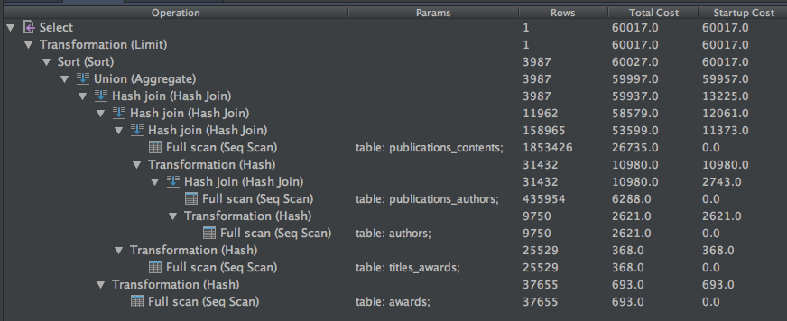
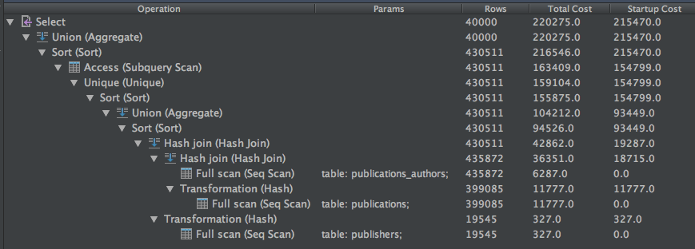
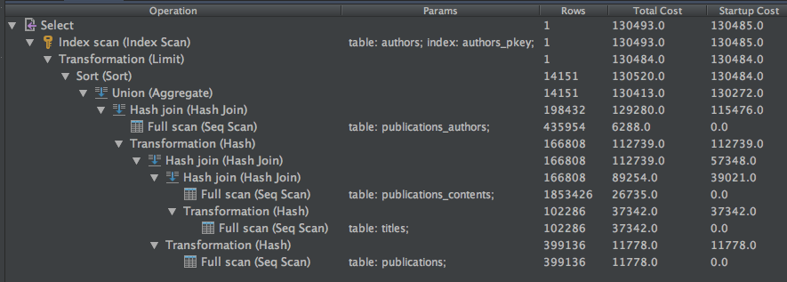

## Query 12
### Description
*Output the name of the author who has received the most awards after his/her death.*

```
SELECT a.name
FROM authors a
  JOIN publications_authors pa ON a.id = pa.author_id
  JOIN publications_contents pc ON pa.publication_id = pc.publication_id
  JOIN titles_awards ta ON pc.title_id = ta.title_id
  JOIN awards aw ON ta.award_id = aw.id
WHERE
  a.death_date IS NOT NULL
  AND aw.date > a.death_date
GROUP BY a.name
ORDER BY COUNT(ta.award_id) DESC
LIMIT 1;
```
This query basically links the tables `authors` and `awards` by doing multiple joins with tables in between. Then it simply checks if the author is dead and filter to keep only the awards that has been received after his death. Finally we order the final results on the number of awards remaining per author and keep only the first result, the one with most award.

### Running time & optimization
The query runs in approximatly **700ms**. This time is mainly distributed between the full scans of tables and joins. We already spent 99.96% of the time when the joins are done. So even if we create an index on fields used in the where clauses or aggregate actions, we won't see any improvement.


### Plan
The plan for query 12 is simple to understand. We see that it first does the join between `authors` and `publications_authors` then joins the resulting table with `publications_contents`, same thing for `titles_awards` and finally `awards`. At this point we still have 3987 rows. The aggregate operation is simply the `COUNT`, then the sort is on `a.name` and the limit keeps only one result.
We can see that the time after the joins is 59997 and at the end of the execution 60017. The time of the joins highly depends on the number of processed rows.


## Query 16
### Description
*For each year, compute the average number of authors per publisher.*

```
SELECT
  r.name,
  r.year,
  AVG(r.count)
FROM (
       SELECT DISTINCT
         pr.name,
         DATE_PART('year', p.date_pub) AS year,
         COUNT(DISTINCT pa.author_id) as count
       FROM publications p
         INNER JOIN publications_authors pa ON pa.publication_id = p.id
         INNER JOIN publishers pr ON pr.id = p.publisher_id
       GROUP BY pr.id, p.date_pub
     ) r
GROUP BY r.year, r.name;
```
This query uses a subquery for it's FROM clause to select for each year and for each publisher, the number of authors per publisher. Then the main query simply group by the year and the publisher and compute the average number of author.

### Running time & optimization
A few runs of this query showed an average running time of **2.1 seconds**. According to the plan a big part of this time is spent doing sort operations. Once in the subquery for the `GROUP BY pr.id, p.date_pub` which takes approximately 34% of the time. Another one in the subquery for the `SELECT DISTINCT` operation takes ~28% of the time. And a last sort appears in the main query when doing the `GROUP BY r.year, r.name` and also take ~28% of the time. The remaining 10% is scanning and joining the tables.

To optimize this query we tried to add an index on fields used in the WHERE, GROUP BY and COUNT operations. The fields are `publications_authors.author_id`, `publishers.id`, `publications.date_pub` and the average running time became around **1.9 seconds**.

### Plan
The plan is also pretty simple to read. First it joins `publications` and `publications_authors` and then the resulting table with `publishers`. Right after this the first sort is executed on `pr.id, p.date_pub` followed by an aggregate action to group by these keys. After that it's basically the same thing that is executed by the main query to sort and group by the year and the name of the publisher.


## Query 21
### Description
*Find the author who has reviewed the most titles*

```
SELECT a.name
FROM authors a
WHERE a.id = (
  SELECT pa.author_id
  FROM publications p
    INNER JOIN publications_authors pa ON pa.publication_id = p.id
    INNER JOIN publications_contents pc ON pc.publication_id = p.id
    INNER JOIN titles t ON t.id = pc.title_id
  WHERE t.type = 'review'
  GROUP BY pa.author_id
  ORDER BY COUNT(DISTINCT pc.title_id) DESC
  LIMIT 1
)
```
To achieve his goal this query will use the title type `review` to filter out the titles that aren't tagged as reviews. Then it will group by author\_id to count for each author the number of distinct titles that they have reviewed. All this computation is done in a subquery that gives back only one author_id, the one with most reviews, which is used by the main query to get his name.

### Running time & optimization
This query runs in approximately **1.1 second**. After the scans and joins we already spent 85% of the time. The rest is taken by the sort for the group by clause on `pa.author_id`. By adding indexes on `publications_authors.author_id` and `titles.type` the speedup isn't visible.

### Plan
The join is first applied on `titles` and `publications_contents`, then on `publications` and finally on `publications_authors`. 
